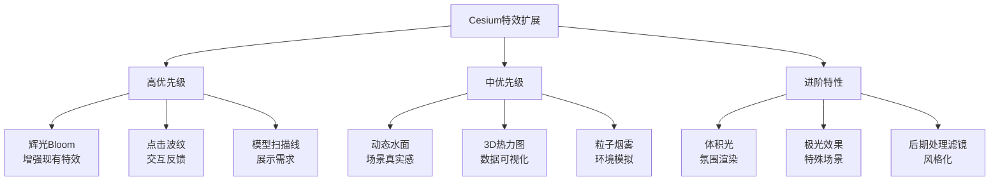

src/views/Map3D/源码/three-cesium-examples-dev，src/views/Map3D/源码/Cesium-Examples-main学习这两个文件夹里面水师怎样开发的，学习完了，重新开发。


用户询问作为专业的Cesium设计师，还能开发什么特效。用户之前已经完成了一些特效（光墙、雷达、流光扩散、飞线），并且添加了主题切换功能。

我应该：
1. 先查看当前项目的特效实现情况，了解已有的特效
2. 基于Cesium的能力，提出更多专业、炫酷的特效建议

让我先查看一下当前项目的特效文件，了解已有的实现。
作为Cesium专业设计师，我来帮你深入挖掘Cesium还能开发的特效！首先让我了解一下你当前已有的特效实现情况。
现在我了解了当前的特效实现情况。用户已有以下特效：
1. 雷达扫描 (Radar)
2. 光墙特效 (LightWall)
3. 流光扩散 (LightSpread)
4. 飞线特效 (FlyLines/PolylineTrail)

还有6套主题切换功能。

作为专业的Cesium设计师，我可以建议以下更多高级特效：

1. **粒子系统特效**：
  - 烟雾/火焰效果
  - 雨雪天气效果
  - 爆炸效果
  - 喷泉/水流效果

2. **后期处理特效 (PostProcessStage)**：
  - 辉光/泛光效果 (Bloom)
  - 景深效果 (Depth of Field)
  - 环境光遮蔽 (Ambient Occlusion)
  - 边缘检测/描边
  - 黑白/老电影滤镜

3. **3D模型特效**：
  - 模型自发光
  - 模型轮廓描边
  - 模型扫描线
  - 模型分解动画

4. **地形/水面特效**：
  - 动态水面
  - 地形热力图
  - 等高线
  - 坡度分析

5. **数据可视化特效**：
  - 3D柱状图/热力图
  - 轨迹回放
  - 动态路径
  - 迁徙图

6. **天空/大气特效**：
  - 动态云层
  - 星空
  - 极光
  - 体积光/丁达尔效应

7. **交互特效**：
  - 点击波纹效果
  - 鼠标悬停高亮
  - 选中框

我可以提供一个详细的特效扩展方案，包括代码实现思路和可视化效果。
作为Cesium专业设计师，基于你已有的**雷达扫描、光墙、流光扩散、飞线**四大核心特效，我为你深度挖掘Cesium还能开发的**七大类高级特效**：

---

## 🎨 一、粒子系统特效 (Particle System)

适合场景：火灾模拟、工业排放、庆典烟花、战场环境

| 特效名称 | 技术实现 | 视觉效果 |
|---------|---------|---------|
| **火焰/烟雾** | `Cesium.ParticleSystem` + 自定义纹理 | 实时燃烧的火焰和升腾的烟雾 |
| **雨雪天气** | 粒子系统 + 物理模拟 | 逼真的降水效果，可控制风向强度 |
| **烟花爆炸** | 发射器 + 粒子生命周期 | 节日庆典的绚丽烟花 |
| **喷泉/水流** | 向上发射器 + 重力模拟 | 城市喷泉、瀑布效果 |

```typescript
// 火焰粒子系统示例
const fireParticleSystem = viewer.scene.primitives.add(
  new Cesium.ParticleSystem({
    image: '/textures/fire.png',
    startColor: Cesium.Color.RED.withAlpha(0.7),
    endColor: Cesium.Color.YELLOW.withAlpha(0.0),
    startScale: 1.0,
    endScale: 3.0,
    minimumParticleLife: 1.0,
    maximumParticleLife: 3.0,
    emissionRate: 100,
    emitter: new Cesium.ConeEmitter(Cesium.Math.toRadians(30)),
    gravity: -9.8,
    imageSize: new Cesium.Cartesian2(20, 20)
  })
)
```

---

## ✨ 二、后期处理特效 (PostProcessStage)

Cesium最强大的视觉效果层，在渲染完成后添加滤镜效果：

| 特效名称 | 实现类 | 应用场景 |
|---------|-------|---------|
| **辉光/泛光 (Bloom)** | `PostProcessStageLibrary.createBloomStage()` | 霓虹灯、能量核心发光效果 |
| **景深 (Depth of Field)** | 自定义后处理阶段 | 聚焦主体、背景虚化 |
| **环境光遮蔽 (SSAO)** | 多通道渲染 | 增加场景立体感 |
| **边缘检测/描边** | 基于Sobel算子的Shader | 选中高亮、轮廓强调 |
| **夜视/热成像** | 自定义后处理Shader | 军事模拟、安防监控 |
| **扫描线/故障风** | GLSL后处理 | 赛博朋克风格 |

```typescript
// 辉光效果 - 让你的特效更加绚丽
const bloom = viewer.scene.postProcessStages.add(
  Cesium.PostProcessStageLibrary.createBloomStage()
)
bloom.uniforms.glowOnly = false
bloom.uniforms.contrast = 128
bloom.uniforms.brightness = -0.3
bloom.uniforms.delta = 1.0
bloom.uniforms.sigma = 3.78
bloom.uniforms.stepSize = 5.0
```

---

## 🏗️ 三、3D 模型高级特效

| 特效名称 | 核心技术 | 效果描述 |
|---------|---------|---------|
| **模型扫描线** | CustomShader + 时间uniform | 从上到下的激光扫描效果 |
| **模型自发光** | PBR材质 + emissive属性 | 模型特定部位发光 |
| **模型轮廓描边** | Stencil Buffer + 后处理 | 选中物体的边缘高亮 |
| **模型分解动画** | Primitive变形 + 插值 | 爆炸视图、零件拆解 |
| **透明剖面** | ClippingPlane + 双面渲染 | 建筑内部结构展示 |

```typescript
// 模型扫描线特效
const scanLineShader = new Cesium.CustomShader({
  uniforms: {
    u_scanTime: Cesium.UniformType.FLOAT,
    u_scanColor: Cesium.UniformType.VEC4
  },
  fragmentShaderText: `
    void fragmentMain(FragmentInput fsInput, inout czm_modelMaterial material) {
      float height = fsInput.attributes.positionMC.z;
      float scanLine = fract(u_scanTime) * 100.0; // 扫描高度
      
      float diff = abs(height - scanLine);
      if (diff < 5.0) {
        float intensity = 1.0 - diff / 5.0;
        material.emissive = u_scanColor.rgb * intensity;
        material.alpha = 1.0;
      }
    }
  `
})
```

---

## 🌊 四、地形与水面特效

| 特效名称 | 实现方式 | 视觉效果 |
|---------|---------|---------|
| **动态水面** | WaterMaterial + 法线动画 | 波光粼粼的逼真水面 |
| **地形热力图** | 自定义Primitive + 颜色映射 | 根据数据着色地形 |
| **等高线** | Material + 等高线Shader | 地形高度可视化 |
| **坡度分析** | 地形法线计算 + 颜色分级 | 工程分析、滑雪场景 |
| **地形开挖** | ClippingPlane + 洞穴渲染 | 地下管线、矿井展示 |

```typescript
// 动态水面材质
const waterMaterial = new Cesium.Material({
  fabric: {
    type: 'Water',
    uniforms: {
      baseWaterColor: new Cesium.Color(0.2, 0.3, 0.6, 0.8),
      blendColor: new Cesium.Color(0.0, 0.3, 0.6, 0.6),
      specularMap: '/textures/water-specular.jpg',
      normalMap: '/textures/water-normal.jpg',
      frequency: 1000.0,
      animationSpeed: 0.01,
      amplitude: 10.0
    }
  }
})
```

---

## 📊 五、数据可视化特效

| 特效名称 | 技术实现 | 数据场景 |
|---------|---------|---------|
| **3D柱状图/热力柱** | Primitive + 高度映射 | 人口密度、销售额 |
| **动态迁徙图** | Polyline + 流动纹理 | 人口流动、航班航线 |
| **轨迹回放** | SampledPositionProperty | 车辆/船只历史轨迹 |
| **实时轨迹** | CallbackProperty | 实时监控、追踪 |
| **蜂巢网格** | 六边形聚合 + 高度着色 | 大数据聚合展示 |

```typescript
// 3D热力柱状图
function createHeatmapBar(lon: number, lat: number, value: number) {
  const height = value * 100 // 数据映射为高度
  
  return viewer.entities.add({
    position: Cesium.Cartesian3.fromDegrees(lon, lat, height / 2),
    cylinder: {
      length: height,
      topRadius: 500,
      bottomRadius: 500,
      material: getHeatColor(value), // 根据值获取颜色
      outline: true,
      outlineColor: Cesium.Color.WHITE
    }
  })
}
```

---

## 🌌 六、天空与大气特效

| 特效名称 | 实现方式 | 氛围效果 |
|---------|---------|---------|
| **动态云层** | SkyBox + 云层贴图动画 | 逼真的天气变化 |
| **星空银河** | 自定义SkyBox | 夜间模式、天文展示 |
| **体积光/丁达尔效应** | 光束Shader + 大气散射 | 森林光线、教堂彩窗 |
| **极光 (Aurora)** | 顶点着色器 + 噪声函数 | 极地场景 |
| **彩虹** | 圆环Primitive + 渐变材质 | 雨后场景 |

```typescript
// 极光效果 - 着色器实现
const auroraShader = `
  uniform float u_time;
  
  float noise(vec2 p) {
    return fract(sin(dot(p, vec2(12.9898, 78.233))) * 43758.5453);
  }
  
  void main() {
    vec2 uv = gl_FragCoord.xy / resolution.xy;
    
    // 极光波浪形状
    float wave = sin(uv.x * 10.0 + u_time) * 0.1;
    float band = smoothstep(0.3 + wave, 0.0, abs(uv.y - 0.5));
    
    // 颜色渐变 - 绿到紫
    vec3 auroraColor = mix(
      vec3(0.0, 1.0, 0.4),  // 绿色
      vec3(0.8, 0.0, 1.0),  // 紫色
      sin(uv.x * 3.14159) * 0.5 + 0.5
    );
    
    gl_FragColor = vec4(auroraColor * band, band * 0.8);
  }
`
```

---

## 🎯 七、交互反馈特效

| 特效名称 | 触发场景 | 视觉效果 |
|---------|---------|---------|
| **点击波纹** | 点击地面 | 类似水波的扩散效果 |
| **鼠标悬停高亮** | 悬停实体 | 发光+放大提示 |
| **选中扫描框** | 选中物体 | 科技感的边框扫描 |
| **路径导航箭头** | 导航模式 | 地面流动箭头指引 |
| **信息标签卡片** | 数据展示 | 3D悬浮信息面板 |

```typescript
// 点击波纹特效
class RippleEffect {
  create(lon: number, lat: number) {
    let radius = 0
    const entity = viewer.entities.add({
      position: Cesium.Cartesian3.fromDegrees(lon, lat),
      ellipse: {
        semiMinorAxis: new Cesium.CallbackProperty(() => {
          radius += 50
          if (radius > 2000) radius = 0
          return radius
        }, false),
        semiMajorAxis: new Cesium.CallbackProperty(() => radius, false),
        material: new Cesium.ColorMaterialProperty(
          new Cesium.CallbackProperty(() => {
            const alpha = 1 - (radius / 2000)
            return Cesium.Color.CYAN.withAlpha(alpha * 0.5)
          }, false)
        ),
        outline: true,
        outlineColor: Cesium.Color.CYAN
      }
    })
  }
}
```

---

## 📋 特效开发优先级建议



---

## 🚀 推荐下一步实现

基于你已有的特效系统，我建议按以下顺序扩展：

1. **辉光(Bloom)后处理** - 一行代码让现有特效绚丽10倍
2. **点击波纹效果** - 增强用户交互体验
3. **3D数据热力柱** - 数据可视化场景必备
4. **粒子系统(烟雾/火焰)** - 工业/应急场景
5. **模型扫描线** - 数字孪生项目常用

需要我为你详细实现其中哪个特效吗？我可以提供完整的代码实现和集成到你的主题系统中！
